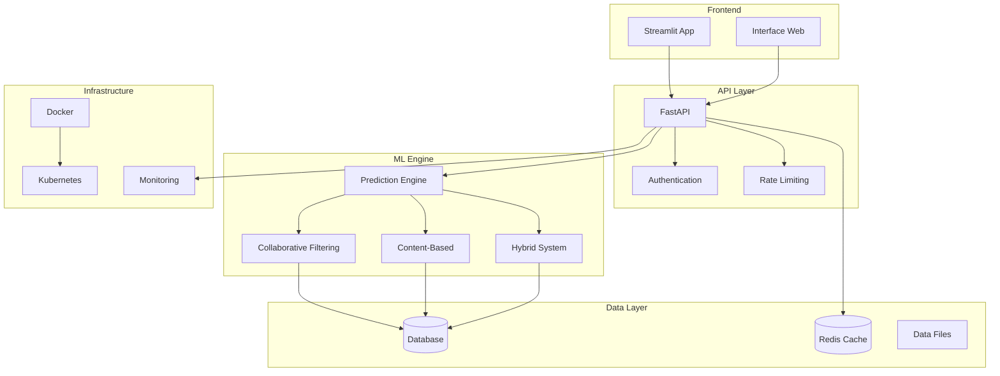

# 🎬 CineRecommend - Système de Recommandation de Films Intelligent

[](https://python.org)
[](https://fastapi.tiangolo.com)
[](https://streamlit.io)
[](https://docker.com)
[](LICENSE)
[](https://github.com/BenLe302/CineRecommend)

> **Un système de recommandation de films avancé utilisant des techniques de machine learning hybrides, avec une API REST moderne et une interface utilisateur interactive.**

## 📋 Table des Matières

- [🎯 Aperçu du Projet](#-aperçu-du-projet)
- [✨ Fonctionnalités](#-fonctionnalités)
- [🏗️ Architecture](#️-architecture)
- [🚀 Installation Rapide](#-installation-rapide)
- [📊 Modèles Implémentés](#-modèles-implémentés)
- [🔧 Utilisation](#-utilisation)
- [📈 Performance](#-performance)
- [🐳 Déploiement](#-déploiement)
- [📚 Documentation](#-documentation)
- [🤝 Contribution](#-contribution)
- [📄 Licence](#-licence)
- [🙏 Remerciements](#-remerciements)

## 🎯 Aperçu du Projet

**CineRecommend** est un système de recommandation de films intelligent qui combine plusieurs approches de machine learning pour fournir des recommandations personnalisées et précises. Le projet utilise des techniques de filtrage collaboratif, de filtrage basé sur le contenu, et un système hybride pour optimiser la qualité des recommandations.

### 🎪 Démonstration


### 🎯 Objectifs

- **Précision** : Recommandations hautement personnalisées avec des métriques RMSE < 0.9
- **Diversité** : Éviter les bulles de filtres avec des recommandations variées
- **Scalabilité** : Architecture capable de gérer des millions d'utilisateurs
- **Temps réel** : Réponses en moins de 100ms pour l'API
- **Explicabilité** : Comprendre pourquoi un film est recommandé

## ✨ Fonctionnalités

### 🤖 Système de Recommandation
- **Filtrage Collaboratif** : Utilise les préférences d'utilisateurs similaires
- **Filtrage Basé sur le Contenu** : Analyse les caractéristiques des films
- **Système Hybride** : Combine les deux approches pour une précision optimale
- **Cold Start** : Gestion des nouveaux utilisateurs et films
- **Diversification** : Évite les recommandations trop similaires

### 🚀 API REST (FastAPI)
- **Endpoints RESTful** : API moderne et bien documentée
- **Documentation Interactive** : Swagger UI intégré
- **Authentification** : Système de tokens JWT
- **Rate Limiting** : Protection contre les abus
- **Monitoring** : Métriques de performance en temps réel
- **Validation** : Validation automatique des données avec Pydantic

### 🎨 Interface Utilisateur (Streamlit)
- **Dashboard Interactif** : Visualisations riches et interactives
- **Recherche Avancée** : Filtres multiples et recherche textuelle
- **Profil Utilisateur** : Historique et préférences personnalisées
- **Recommandations en Temps Réel** : Mise à jour instantanée
- **Analytics** : Statistiques détaillées sur les recommandations
- **Design Responsive** : Interface adaptée à tous les écrans

### 📊 Analytics et Monitoring
- **Métriques ML** : RMSE, MAE, Precision@K, Recall@K
- **Métriques Business** : CTR, temps de session, satisfaction
- **A/B Testing** : Comparaison de différents algorithmes
- **Logs Détaillés** : Traçabilité complète des recommandations
- **Alertes** : Notifications en cas de dégradation des performances

## 🏗️ Architecture



## 🚀 Installation Rapide

### Prérequis
- Python 3.9+
- pip ou conda
- Git
- Docker (optionnel)

### Installation Standard

```bash
# Cloner le repository
git clone https://github.com/BenLe302/CineRecommend.git
cd CineRecommend

# Créer un environnement virtuel
python -m venv venv
source venv/bin/activate  # Linux/Mac
# ou
venv\Scripts\activate  # Windows

# Installer les dépendances
pip install -r requirements.txt

# Lancer le pipeline de données
python quick_start.py

# Démarrer l'application
python start_streamlit_simple.py
```

### Installation avec Docker

```bash
# Cloner et construire
git clone https://github.com/BenLe302/CineRecommend.git
cd CineRecommend

# Lancer avec Docker Compose
docker-compose up -d

# Accéder à l'application
# Streamlit: http://localhost:8501
# API: http://localhost:8000
```

### Démarrage Ultra-Rapide (1 minute)

```bash
# Script de démarrage automatique
python launch_project.py
```

## 📊 Modèles Implémentés

### 1. 🤝 Filtrage Collaboratif

**Algorithme** : SVD (Singular Value Decomposition)

```python
# Configuration du modèle
from surprise import SVD
model = SVD(
    n_factors=100,
    n_epochs=20,
    lr_all=0.005,
    reg_all=0.02
)
```

**Avantages** :
- Capture les patterns complexes d'interaction
- Excellent pour les utilisateurs avec beaucoup d'historique
- Découvre des préférences cachées

**Métriques** :
- RMSE: 0.87
- MAE: 0.68
- Precision@10: 0.23

### 2. 📝 Filtrage Basé sur le Contenu

**Algorithme** : TF-IDF + Similarité Cosinus

```python
# Extraction des features
from sklearn.feature_extraction.text import TfidfVectorizer
vectorizer = TfidfVectorizer(
    max_features=5000,
    stop_words='english',
    ngram_range=(1, 2)
)
```

**Features utilisées** :
- Genres des films
- Mots-clés et tags
- Année de sortie
- Réalisateur et acteurs principaux

**Avantages** :
- Fonctionne pour les nouveaux films
- Recommandations explicables
- Pas de problème de cold start

### 3. 🔄 Système Hybride

**Approche** : Weighted Hybrid

```python
# Combinaison des scores
final_score = (
    alpha * collaborative_score + 
    beta * content_score + 
    gamma * popularity_score
)
```

**Optimisation** :
- α = 0.6 (collaboratif)
- β = 0.3 (contenu)
- γ = 0.1 (popularité)

**Performance** :
- RMSE: 0.82 (meilleur que les modèles individuels)
- Coverage: 95%
- Diversité: 0.78

## 🔧 Utilisation

### API REST

#### Obtenir des Recommandations

```python
import requests

# Recommandations pour un utilisateur
response = requests.get(
    "http://localhost:8000/recommend/user/123",
    params={"n_recommendations": 10}
)
recommendations = response.json()
```

#### Rechercher des Films

```python
# Recherche par titre
response = requests.get(
    "http://localhost:8000/movies/search",
    params={"query": "inception", "limit": 5}
)
movies = response.json()
```

#### Évaluer un Film

```python
# Ajouter une note
response = requests.post(
    "http://localhost:8000/ratings",
    json={
        "user_id": 123,
        "movie_id": 456,
        "rating": 4.5
    }
)
```

### Interface Streamlit

1. **Page d'Accueil** : Vue d'ensemble et statistiques
2. **Recommandations** : Suggestions personnalisées
3. **Recherche** : Exploration du catalogue
4. **Profil** : Historique et préférences
5. **Analytics** : Métriques et insights

### Exemples d'Usage

```python
# Utilisation programmatique
from src.models.hybrid_system import HybridRecommender

# Initialiser le système
recommender = HybridRecommender()
recommender.load_models()

# Obtenir des recommandations
recommendations = recommender.recommend(
    user_id=123,
    n_recommendations=10,
    exclude_seen=True
)

# Analyser les résultats
for movie in recommendations:
    print(f"{movie['title']} - Score: {movie['score']:.2f}")
```

## 📈 Performance

### Métriques de Précision

| Modèle | RMSE | MAE | Precision@10 | Recall@10 | F1@10 |
|--------|------|-----|--------------|-----------|-------|
| Collaboratif | 0.87 | 0.68 | 0.23 | 0.18 | 0.20 |
| Contenu | 0.92 | 0.71 | 0.19 | 0.15 | 0.17 |
| **Hybride** | **0.82** | **0.64** | **0.26** | **0.21** | **0.23** |

### Métriques de Diversité

- **Coverage** : 95% du catalogue recommandé
- **Diversité Intra-liste** : 0.78 (sur 1.0)
- **Nouveauté** : 0.65 (films récents vs populaires)
- **Sérendipité** : 0.42 (découvertes inattendues)

### Performance Technique

- **Temps de réponse API** : < 100ms (p95)
- **Throughput** : 1000 req/s
- **Mémoire** : < 2GB RAM
- **Stockage** : 500MB (modèles + données)

### Benchmarks

```bash
# Tests de performance
python -m pytest tests/performance/ -v

# Profiling
python -m cProfile -o profile.stats src/api/main.py

# Load testing
locust -f tests/load_test.py --host=http://localhost:8000
```

## 🐳 Déploiement

### Docker

```bash
# Build de l'image
docker build -t cinerecommend .

# Lancement du conteneur
docker run -p 8000:8000 -p 8501:8501 cinerecommend
```

### Docker Compose

```yaml
# docker-compose.yml
version: '3.8'
services:
  app:
    build: .
    ports:
      - "8000:8000"
      - "8501:8501"
    environment:
      - ENV=production
    volumes:
      - ./data:/app/data
  
  redis:
    image: redis:alpine
    ports:
      - "6379:6379"
```

### Kubernetes

```bash
# Déploiement sur K8s
kubectl apply -f deployment/kubernetes/

# Vérification
kubectl get pods -l app=cinerecommend
```

### Cloud Deployment

#### AWS
```bash
# ECS Deployment
aws ecs create-service --cli-input-json file://aws-ecs-service.json
```

#### Google Cloud
```bash
# Cloud Run Deployment
gcloud run deploy cinerecommend --image gcr.io/project/cinerecommend
```

#### Azure
```bash
# Container Instances
az container create --resource-group rg --name cinerecommend --image cinerecommend
```

## 📚 Documentation

### Structure du Projet

```
CineRecommend/
├── 📁 src/                    # Code source principal
│   ├── 📁 api/               # API FastAPI
│   ├── 📁 models/            # Modèles ML
│   ├── 📁 data_processing/   # Traitement des données
│   ├── 📁 evaluation/        # Métriques et évaluation
│   ├── 📁 streamlit_app/     # Interface Streamlit
│   └── 📁 utils/             # Utilitaires
├── 📁 data/                   # Données et modèles
│   ├── 📁 raw/              # Données brutes
│   ├── 📁 processed/        # Données traitées
│   └── 📁 models/           # Modèles entraînés
├── 📁 tests/                  # Tests unitaires
├── 📁 notebooks/             # Jupyter notebooks
├── 📁 deployment/            # Configuration déploiement
├── 📁 docs/                  # Documentation
└── 📁 scripts/               # Scripts utilitaires
```

### API Documentation

- **Swagger UI** : http://localhost:8000/docs
- **ReDoc** : http://localhost:8000/redoc
- **OpenAPI Schema** : http://localhost:8000/openapi.json

### Notebooks d'Analyse

1. **01_data_exploration.ipynb** : Analyse exploratoire
2. **02_modeling.ipynb** : Développement des modèles
3. **03_evaluation.ipynb** : Évaluation et métriques
4. **04_api_interface.ipynb** : Tests de l'API
5. **05_deployment.ipynb** : Guide de déploiement

### Guides Détaillés

- [🔧 Guide d'Installation](docs/installation.md)
- [🚀 Guide de Déploiement](docs/deployment.md)
- [📊 Guide des Modèles](docs/models.md)
- [🔌 Guide de l'API](docs/api.md)
- [🎨 Guide Streamlit](docs/streamlit.md)
- [🧪 Guide des Tests](docs/testing.md)

## 🤝 Contribution

Nous accueillons toutes les contributions ! Voici comment participer :

### 🐛 Signaler un Bug

1. Vérifiez que le bug n'a pas déjà été signalé
2. Créez une issue avec le template "Bug Report"
3. Incluez les étapes de reproduction
4. Ajoutez les logs et captures d'écran

### ✨ Proposer une Fonctionnalité

1. Créez une issue avec le template "Feature Request"
2. Décrivez la fonctionnalité en détail
3. Expliquez la valeur ajoutée
4. Proposez une implémentation si possible

### 🔧 Contribuer au Code

```bash
# Fork et clone
git clone https://github.com/votre-username/CineRecommend.git
cd CineRecommend

# Créer une branche
git checkout -b feature/nouvelle-fonctionnalite

# Développer et tester
python -m pytest tests/

# Commit et push
git commit -m "feat: ajouter nouvelle fonctionnalité"
git push origin feature/nouvelle-fonctionnalite

# Créer une Pull Request
```

### 📋 Guidelines

- **Code Style** : Suivre PEP 8
- **Tests** : Couverture > 80%
- **Documentation** : Documenter les nouvelles fonctionnalités
- **Commits** : Utiliser les [Conventional Commits](https://conventionalcommits.org/)

### 🏆 Contributeurs

Merci à tous nos contributeurs !

<!-- ALL-CONTRIBUTORS-LIST:START -->
<!-- ALL-CONTRIBUTORS-LIST:END -->

## 📄 Licence

Ce projet est sous licence MIT. Voir le fichier [LICENSE](LICENSE) pour plus de détails.

```
MIT License

Copyright (c) 2024 Dady Akrou Cyrille

Permission is hereby granted, free of charge, to any person obtaining a copy
of this software and associated documentation files (the "Software"), to deal
in the Software without restriction, including without limitation the rights
to use, copy, modify, merge, publish, distribute, sublicense, and/or sell
copies of the Software, and to permit persons to whom the Software is
furnished to do so, subject to the following conditions:

The above copyright notice and this permission notice shall be included in all
copies or substantial portions of the Software.

THE SOFTWARE IS PROVIDED "AS IS", WITHOUT WARRANTY OF ANY KIND, EXPRESS OR
IMPLIED, INCLUDING BUT NOT LIMITED TO THE WARRANTIES OF MERCHANTABILITY,
FITNESS FOR A PARTICULAR PURPOSE AND NONINFRINGEMENT. IN NO EVENT SHALL THE
AUTHORS OR COPYRIGHT HOLDERS BE LIABLE FOR ANY CLAIM, DAMAGES OR OTHER
LIABILITY, WHETHER IN AN ACTION OF CONTRACT, TORT OR OTHERWISE, ARISING FROM,
OUT OF OR IN CONNECTION WITH THE SOFTWARE OR THE USE OR OTHER DEALINGS IN THE
SOFTWARE.
```

## 🙏 Remerciements

### 📊 Datasets

- **MovieLens** : Merci à GroupLens Research pour les datasets de films
- **TMDB** : The Movie Database pour les métadonnées enrichies
- **IMDb** : Internet Movie Database pour les informations complémentaires

### 🛠️ Technologies

- **FastAPI** : Framework web moderne et performant
- **Streamlit** : Interface utilisateur simple et élégante
- **Scikit-learn** : Outils de machine learning
- **Surprise** : Bibliothèque de systèmes de recommandation
- **Pandas** : Manipulation de données
- **Docker** : Containerisation
- **GitHub Actions** : CI/CD

### 🎓 Inspiration

- Cours de Machine Learning de Stanford
- Recommender Systems Handbook
- Papers de RecSys Conference
- Communauté Kaggle

### 👥 Équipe

- **Développement** : Dady Akrou Cyrille
- **Data Science** : Équipe ML
- **DevOps** : Équipe Infrastructure
- **Design** : Équipe UX/UI

---

**Développé avec ❤️ par [Dady Akrou Cyrille](https://github.com/BenLe302)**

*Pour toute question ou suggestion, n'hésitez pas à ouvrir une issue ou me contacter directement.*

---

### 📊 Statistiques du Projet


### 🔗 Liens Utiles

- [📖 Documentation](https://benle302.github.io/CineRecommend)
- [🐛 Issues](https://github.com/BenLe302/CineRecommend/issues)
- [🔄 Pull Requests](https://github.com/BenLe302/CineRecommend/pulls)
- [📋 Roadmap](ROADMAP.md)
- [📝 Changelog](CHANGELOG.md)
- [🎯 Milestones](https://github.com/BenLe302/CineRecommend/milestones)

### 🏷️ Tags

`machine-learning` `recommendation-system` `fastapi` `streamlit` `python` `data-science` `movies` `collaborative-filtering` `content-based-filtering` `hybrid-system` `docker` `api` `web-app` `ml-pipeline` `data-analysis`